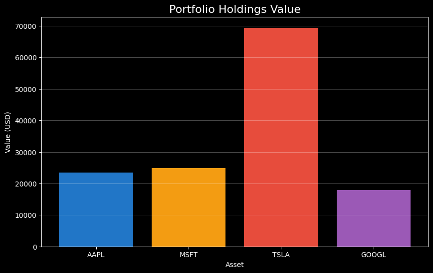

# 📊 Custody NAV Calculator: How it works

I created a simple Python tool to automate **Net Asset Value (NAV)** calculation for custody funds.

Pros of the script instead of manual Excel reports:
- Pulls live market data (updated using Yahoo Finance)
- Calculates portfolio value
- Adds cash position
- Outputs NAV per share

### Once you update live data, liquidity, or the number of shares, it will be updated automatically!!

---

## 🚀 Purpose of the tool:
- ✅ Reduces manual errors
- ✅ Automates daily reporting / makes it faster
- ✅ Scales to multiple funds
- ✅ Built with tools used in modern finance (Python, pandas, yfinance)

## 🛠 How to Run using Google Colab / IDLE
1. Install dependencies:
   ```bash
   pip install pandas yfinance

## 📊 Example Output


| Total Portfolio Value | $135,721.75 |
| ---- | ----|
| Cash | $5,000.00 |
| NAV | $140,721.75 |
| NAV per Share | $140.72 |


*Visual representation of asset distribution in the fund.*
